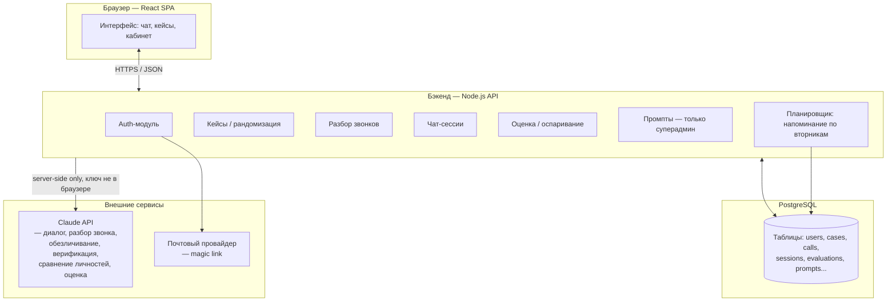
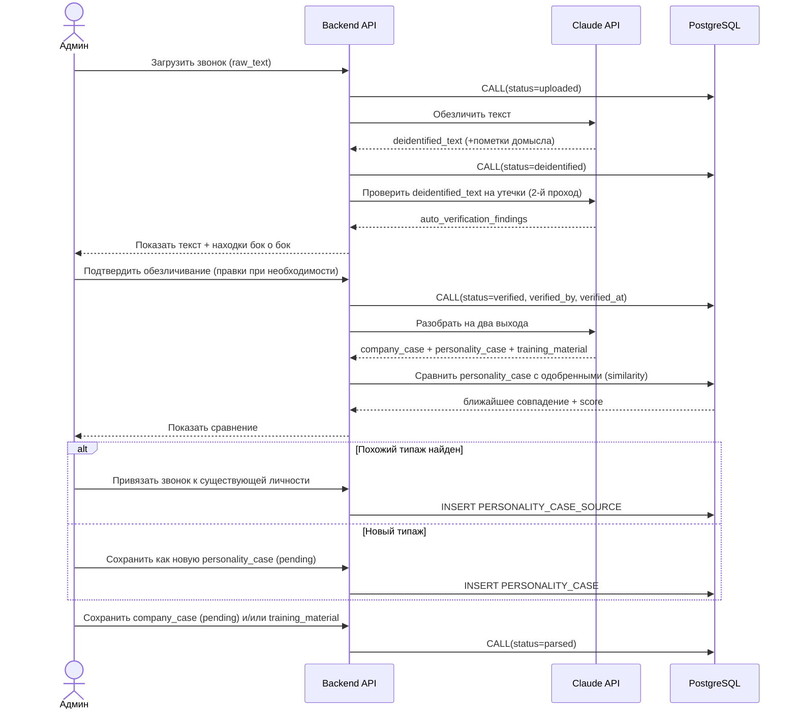
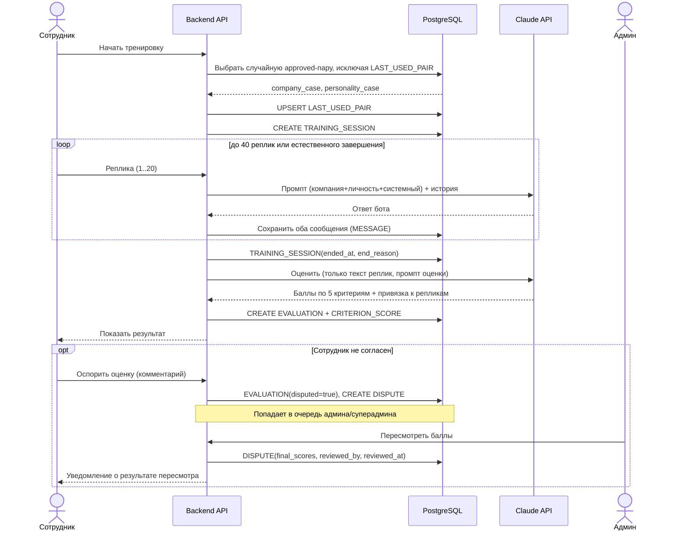
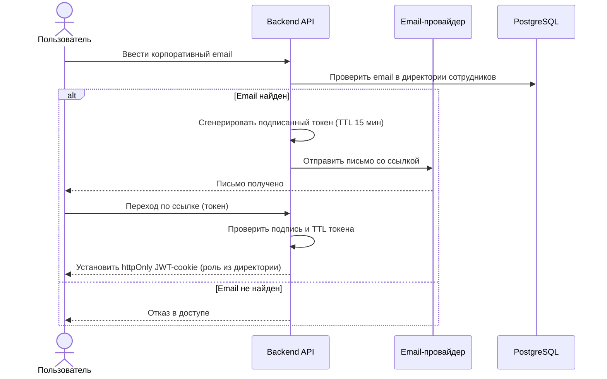
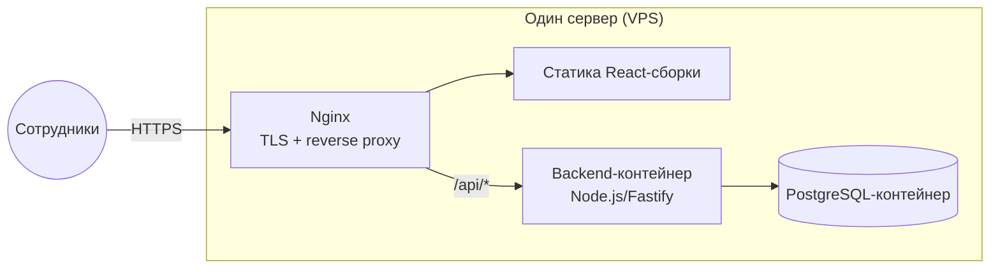

# Техническая спецификация: Оттоку.net по продлению

*Сопроводительный документ к «Концепция_тренажер_продления_ULTIMATE.md» — описывает, из чего и как это строится технически: языки, технологии, структура данных, связи между компонентами, диаграммы.*

## 1. Архитектура — общая картина

Классическое трёхзвенное веб-приложение: SPA-клиент, бэкенд-API, реляционная БД, плюс внешний вызов LLM исключительно с сервера. Микросервисы, очереди сообщений, отдельные воркер-кластеры — не нужны при описанных объёмах (десятки сотрудников, тысячи диалогов, ~1200 звонков на входе). Один монолитный бэкенд, разделённый по модулям, полностью закрывает нагрузку и проще в поддержке одним человеком/маленькой командой.



**Почему так:** ключ к LLM и к БД не должен физически существовать в браузере (раздел 15 концепции) — единственный способ это гарантировать — все вызовы модели идут через бэкенд. Планировщик (напоминание по вторникам, раздел 6 концепции) живёт тоже на бэкенде как обычный cron-процесс, не отдельный сервис.

## 2. Технологический стек

| Слой | Выбор | Почему именно это |
|---|---|---|
| Frontend | **React 18 + TypeScript + Vite** | Прототип уже на React (`renewal_trainer_prototype.jsx`) — прямое продолжение, не переписывание с нуля. Vite — быстрая сборка и dev-сервер. |
| Стилизация | **Tailwind CSS** | Быстрая вёрстка панелей/таблиц/статусов без написания CSS-файлов вручную, легко поддерживать один человеком. |
| Состояние / запросы | **TanStack Query (React Query)** | Кеширование запросов, автоматический рефетч (важно для статусов кейсов и очереди на проверку, которые меняются у разных пользователей). |
| Backend | **Node.js + TypeScript + Fastify** | Тот же язык (TypeScript), что и на фронте — общие типы данных (интерфейсы кейсов, сообщений, оценок) без дублирования и рассинхронизации. Fastify — ниже накладные расходы, встроенная валидация схем запросов (важно: анкеты кейсов, промпты, оценки — все со строгой структурой). |
| ORM / доступ к БД | **Prisma** | Строгая типизация схемы БД, миграции версионируются в репозитории, минимизирует ошибки при частых правках структуры (кейсы, оценки, диспуты). |
| База данных | **PostgreSQL** | Конкурентная запись при параллельных диалогах у разных сотрудников (раздел 14 концепции уже фиксирует этот выбор для продакшена) — SQLite не годится, как только больше одного человека пишет одновременно. |
| Аутентификация | **Magic link через бэкенд** (одноразовая подписанная ссылка с TTL 15 минут, JWT в httpOnly-cookie после перехода) | Не требует пароля (риск утечки, поддержка сброса), не требует SMS-инфраструктуры. Проще кода на почту (не нужен экран ввода кода, меньше UI). |
| Email-провайдер | **Postmark или SendGrid** (транзакционные письма) | Надёжная доставка, не спам-фильтруется так, как письма с обычного SMTP. |
| LLM | **Claude API (Anthropic), модель Claude Sonnet 5** | Единая модель на все текстовые задачи: диалог бота-клиента, обезличивание, верификация обезличивания, сравнение личностей, разбор звонка на два выхода, оценка диалога. Все вызовы — раздельные, с изолированным контекстом (раздел 9 концепции: оценщик не видит промпты личности/компании). |
| Инфраструктура | **Docker Compose на одном VPS** (frontend статикой через Nginx, backend в контейнере, Postgres в контейнере) | Соответствует требованию «отдельный домен, доступный команде каждый день» (раздел 15) без затрат на управляемый кластер — не тот масштаб, чтобы platform-as-a-service или Kubernetes окупались. |
| TLS | **Nginx + Let's Encrypt (certbot)** | Стандартное решение для одного домена на одном сервере. |
| Планировщик задач | **node-cron внутри backend-процесса** | Еженедельное напоминание по вторникам — не нагрузка, отдельный сервис избыточен. |

## 3. Структура данных

### 3.1. ER-диаграмма

```mermaid
erDiagram
    USER ||--o{ TRAINING_SESSION : "проходит"
    USER ||--o{ MANAGER_COMMENT : "получает"
    USER ||--o{ MANAGER_COMMENT : "оставляет (как руководитель)"
    USER ||--o{ CALL : "загружает"
    USER ||--o{ PROMPT_VERSION : "правит (только суперадмин)"

    CALL ||--o| COMPANY_CASE : "порождает"
    CALL ||--o{ PERSONALITY_CASE_SOURCE : "может быть источником"
    CALL ||--o| TRAINING_MATERIAL : "порождает (Выход 2)"

    PERSONALITY_CASE ||--o{ PERSONALITY_CASE_SOURCE : "имеет источники"

    COMPANY_CASE ||--o{ TRAINING_SESSION : "используется в"
    PERSONALITY_CASE ||--o{ TRAINING_SESSION : "используется в"

    TRAINING_SESSION ||--o{ MESSAGE : "содержит"
    TRAINING_SESSION ||--o| EVALUATION : "получает"

    EVALUATION ||--o{ CRITERION_SCORE : "содержит"
    EVALUATION ||--o| DISPUTE : "может иметь"

    USER {
        uuid id PK
        string email UK
        string name
        enum role "employee|admin|superadmin"
        timestamp created_at
    }

    CALL {
        uuid id PK
        text raw_text
        text deidentified_text
        jsonb auto_verification_findings
        enum status "uploaded|deidentified|verified|parsed|archived"
        uuid verified_by FK
        timestamp verified_at
        uuid uploaded_by FK
        timestamp created_at
    }

    COMPANY_CASE {
        uuid id PK
        string title
        string industry
        string staff_size
        text tools_used
        text renewal_context
        enum status "pending|approved|archived"
        uuid source_call_id FK
        timestamp created_at
    }

    PERSONALITY_CASE {
        uuid id PK
        string name
        text personality_description
        text typical_objections
        enum status "pending|approved|archived"
        timestamp created_at
    }

    PERSONALITY_CASE_SOURCE {
        uuid personality_case_id FK
        uuid call_id FK
        float similarity_score "оценка схожести при добавлении"
    }

    TRAINING_MATERIAL {
        uuid id PK
        uuid call_id FK
        string title
        text situation_summary
        text key_moments
        text verdict
        text lessons
        boolean became_bot_case
        timestamp created_at
    }

    TRAINING_SESSION {
        uuid id PK
        uuid user_id FK
        uuid company_case_id FK
        uuid personality_case_id FK
        timestamp started_at
        timestamp ended_at
        enum end_reason "resolved|reply_limit"
    }

    MESSAGE {
        uuid id PK
        uuid session_id FK
        enum sender "employee|bot"
        int sequence_number
        text content
        timestamp created_at
    }

    EVALUATION {
        uuid id PK
        uuid session_id FK
        int total_score
        text overall_comment
        boolean disputed
        timestamp created_at
    }

    CRITERION_SCORE {
        uuid id PK
        uuid evaluation_id FK
        int criterion_number "1..5"
        int score
        text comment
        uuid linked_message_id FK "привязка к реплике"
    }

    DISPUTE {
        uuid id PK
        uuid evaluation_id FK
        text employee_comment
        jsonb original_scores
        jsonb final_scores
        uuid reviewed_by FK
        timestamp reviewed_at
    }

    MANAGER_COMMENT {
        uuid id PK
        uuid employee_id FK
        uuid manager_id FK
        text content
        boolean visible_to_employee
        timestamp created_at
    }

    PROMPT_VERSION {
        uuid id PK
        enum slot "system|evaluation"
        text content
        uuid edited_by FK
        timestamp edited_at
    }

    LAST_USED_PAIR {
        uuid user_id PK_FK
        uuid company_case_id FK
        uuid personality_case_id FK
        timestamp used_at
    }
```

### 3.2. Комментарии к ключевым решениям в структуре

- **`PERSONALITY_CASE_SOURCE`** — отдельная таблица-связка (many-to-many между звонком и личностью), потому что один типаж личности может иметь несколько звонков-источников (раздел 5.2 концепции). Хранит `similarity_score` — числовую оценку схожести на момент привязки, для аудита решений админа.
- **`CRITERION_SCORE.linked_message_id`** — прямая ссылка на конкретную реплику диалога, а не просто текст комментария. Это то, что делает оспаривание оценки (раздел 11 концепции) проверяемым: админ при разборе спора видит и вердикт, и точное место в диалоге, к которому он относится.
- **`DISPUTE`** хранит `original_scores` и `final_scores` как снимки (jsonb), а не пересчитывает задним числом — исходная оценка ИИ должна остаться неизменной для истории, даже если админ её скорректировал.
- **`PROMPT_VERSION`** — история версий, а не одно поле «текущий промпт», потому что зафиксирована возможность отката (раздел 9 концепции). Слоты «компания» и «личность» сюда не входят — они не самостоятельные тексты, а собираются на лету из `COMPANY_CASE` / `PERSONALITY_CASE` (раздел 9, колонка «Как формируется»).
- **`LAST_USED_PAIR`** — таблица с одной строкой на пользователя (не история), потому что анти-повтор (раздел 8) учитывает только последнюю пару.
- **`CALL.status`** проходит строго последовательно: `uploaded → deidentified → verified → parsed`; переход в `verified` невозможен без обязательного подтверждения админа (раздел 6, шаг 3) — это ограничение накладывается в API-слое, не только в БД.

## 4. Ключевые потоки (sequence-диаграммы)

### 4.1. Разбор звонка → кейсы (раздел 6 концепции)



### 4.2. Тренировочная сессия + оценка + оспаривание (разделы 8, 10, 11)



### 4.3. Аутентификация (magic link)



## 5. Изоляция промптов — как это реализовано технически

Раздел 9 концепции требует, чтобы оценщик не видел промпты личности/компании. Технически это не «доверие на слово», а структурное разделение вызовов к LLM:

- **Вызов диалога с ботом-клиентом** — системное сообщение собирается сервером из трёх частей (`system prompt` + рендер `company_case` по шаблону + `personality_case.personality_description`), отправляется в Claude API как `system` + история `messages`. Ни при каких условиях в этот вызов не попадает контент `EVALUATION` промпта.
- **Вызов оценки** — отдельный, независимый HTTP-запрос к Claude API. В `system` идёт только содержимое `PROMPT_VERSION(slot=evaluation)`, в `messages` — только сохранённые `MESSAGE.content` этой сессии (роли `employee`/`bot`, без каких-либо системных промптов). На уровне кода это буквально два разных модуля (`ChatAPI` и `EvalAPI`), не разделяемые общей функцией сборки промпта — так исключается риск, что при рефакторинге кто-то случайно «склеит» промпты в один вызов.
- **Вызов обезличивания/верификации/разбора звонка/сравнения личностей** — ещё четыре независимых вызова в `CallAPI`, каждый со своим узким системным промптом, без доступа к промпту оценки или системному промпту бота.

## 6. Безопасность

- **Роль всегда проверяется на сервере**, не на клиенте: JWT в httpOnly-cookie содержит `role`, каждый защищённый эндпоинт (`/prompts/*`, `/admin/*`) проверяет роль middleware'ом до выполнения запроса. Фронтенд скрывает недоступные вкладки только для UX — не является границей безопасности.
- **Ключ Claude API живёт только в переменных окружения бэкенда** (`.env`, не в репозитории), запросы к модели идут исключительно с сервера.
- **PII-гейт перед публикацией** (раздел 6, шаг 3 концепции) технически реализован как обязательное поле `CALL.verified_by` — API отклоняет запрос на сохранение `training_material` или `company_case`/`personality_case`, если `CALL.status != 'verified'`.
- **История правок промптов и оценок** (`PROMPT_VERSION`, `DISPUTE`) хранится, а не перезаписывается — нужна для отката и для разбора спорных случаев постфактум.

## 7. Деплой



`docker-compose.yml` — три сервиса (`frontend`, `backend`, `postgres`), плюс `nginx` как reverse proxy с сертификатом Let's Encrypt. Переменные окружения (`CLAUDE_API_KEY`, `DATABASE_URL`, `EMAIL_PROVIDER_KEY`, `JWT_SECRET`) — только в `.env` на сервере, не в образе и не в репозитории.

## 8. Почему этот стек, а не другой — итог

- **TypeScript на фронте и бэке** — общие типы данных для кейсов/сообщений/оценок избавляют от рассинхронизации схем между клиентом и сервером, критично при частых изменениях структуры (уже видно по числу правок в этой концепции).
- **PostgreSQL, а не SQLite** — единственная развилка, где это принципиально: несколько сотрудников одновременно проходят диалоги, SQLite не спроектирован под конкурентную запись такого рода.
- **Один монолитный бэкенд, а не микросервисы** — при десятках пользователей и тысячах записей разделение на сервисы добавляет только эксплуатационную сложность без выигрыша в производительности или надёжности.
- **Одна LLM-модель (Claude) на все текстовые задачи** — единообразие: одна точка интеграции, один SDK, один формат обработки ошибок/ретраев, вместо разных провайдеров под разные задачи без явной необходимости.
